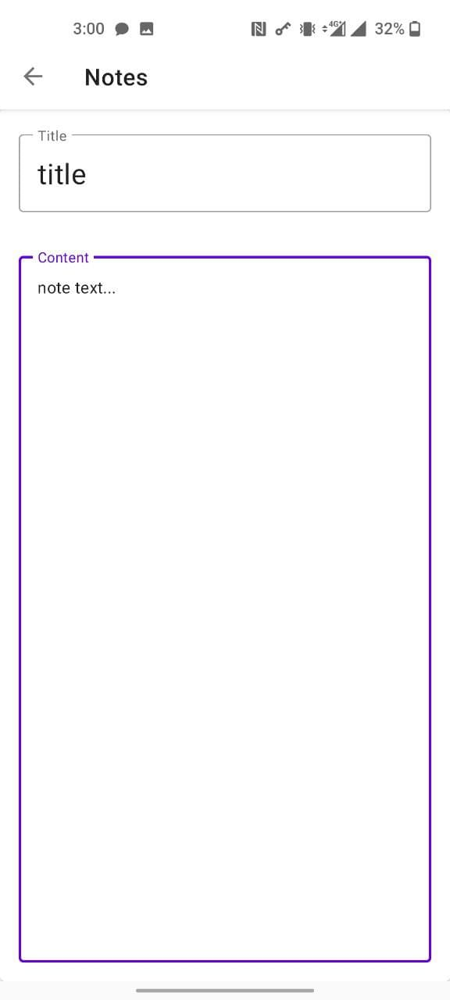
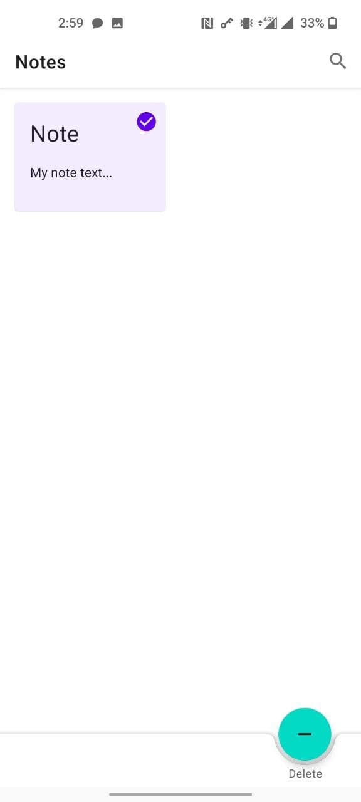
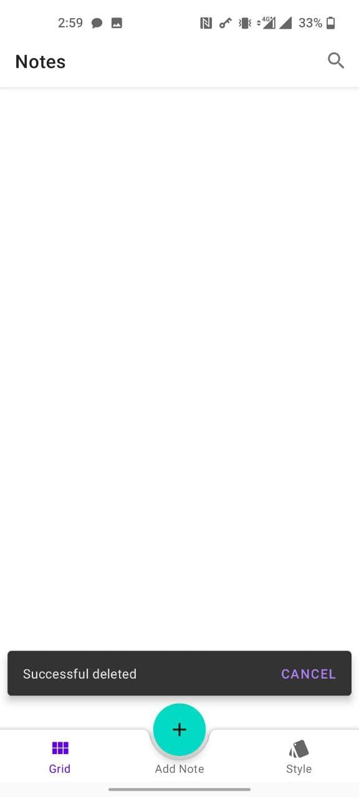

# <code></code> Notes 

## Table of Contents

- [Description](#description)
- [Tools](#tools)
- [Installation](#installation)
- [Screenshots](#screenshots)

## Description
  
- The simple Android Application - Notes. 
- Created like education application to show (demonstrate) my own basic knowledge. 
- This project is made in Material design guidelines.
- Gonna be my first application in Play Market. 
- In the future it may be something more.

## Tools

- Kotlin
- MVVM
- Room database
- Navigation component / Jetpack's navigation
- Coroutines

## Installation

You can use [Github release version](https://github.com/Slex93/Notes/releases)  
You can use [Play market version](https://play.google.com/store/apps/details?id=com.stslex93.notes)

## Screenshots

 
 
